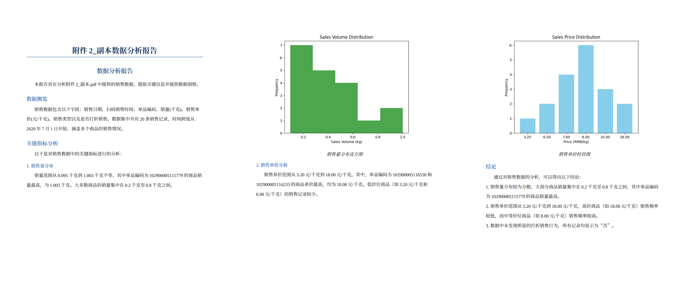

# CTAgent: A Comprehensive Tool Agent for Report Automation

Official code of Tencent Open project, developed by CASIA & Tsinghua University.

## Introduction

CTAgent is a tool for automatically generating file analysis reports. It supports the analysis of files in formats such as `pdf`, `md`, and `csv`. Due to token-based pricing, this tool features a self-routing mechanism that can invoke either locally deployed models or APIs based on the requirements. It is a comprehensive tool **Multi-Agent**. Below is an example:



## Installation
```bash

# Clone this repo
git clone https://github.com/ZhengboZhang/CTAgent.git
cd CTAgent

# Create a conda enviroment
conda create -n ctagent python=3.10 -y
conda activate ctagent

# Install PyTorch. Below is a sample command to do this, but you should check the following link
# to find installation instructions that are specific to your compute platform:
# https://pytorch.org/get-started/locally/
pip3 install torch torchvision torchaudio --index-url https://download.pytorch.org/whl/cu128 # UPDATE ME!

pip install -r requirements.txt

```

## Running

```bash

python ./client.py

```

## Contact
If you have any questions, please feel free to email chen-x25@mails.tsinghua.edu.cn
