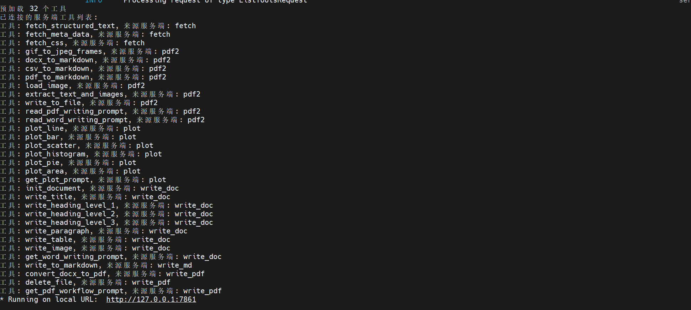
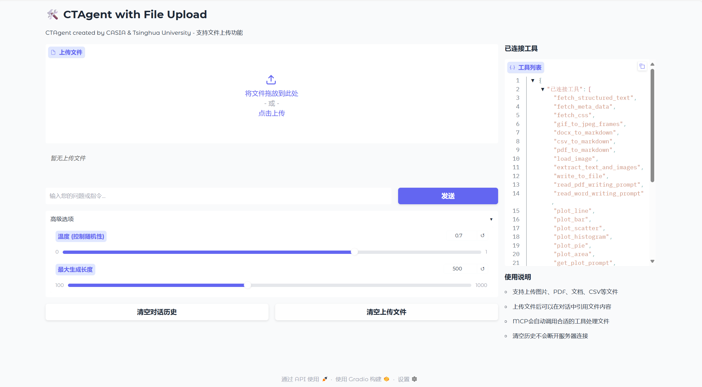

<center>
  <h1>CTAgent: 基于 MCP 的多模态文档智能分析助手</h1>
</center>

### 1 项目介绍

CTAgent 是一个基于 Model Context Protocol (MCP) 构建的先进 LLM 智能体系统，专为高效、灵活地处理与分析多模态文档而设计。

CTAgent is a tool for automatically generating file analysis reports. It supports the analysis of files in formats such as `pdf`, `md`, and `csv`. Due to token-based pricing, this tool features a self-routing mechanism that can invoke either locally deployed models or APIs based on the requirements. It is a comprehensive tool **Multi-Agent**. Below is an example:


**核心功能：**

- **多格式文档读取:** 支持 PDF、DOCX、CSV 及多种图像格式（包括 GIF），轻松提取文本与结构化数据。

- **智能分析与生成:** 依托大语言模型能力，对内容进行深度理解与推理，并可输出专业的 PDF 或 Word 格式分析报告，同时可以生成指定的图表。

- **模块化工具集:** 通过一系列精心设计的 MCP 工具实现功能调用，保证系统的可扩展性与稳定性。

- **友好用户界面:** 提供直观的 Web 前端，使用户能够轻松上传文件、执行任务并查看生成结果。

- **跨节点调用**：实现前端读取文件，传输指后台服务器处理，提高文件处理效率。

- **路由模型**：用户可以选择是否使用本地路由模型，根据任务提取判断调用mcptool类型，节约token。

CTAgent 致力于帮助用户自动化文档处理流程，适用于数据分析、报告生成和内容摘要等多种应用场景。欢迎探索并贡献代码！

### 2 使用说明

**环境安装：**

```bash

# Clone this repo
git clone https://github.com/ZhengboZhang/CTAgent.git
cd CTAgent

# Create a conda enviroment
conda create -n ctagent python=3.11 -y
conda activate ctagent

# Install PyTorch. Below is a sample command to do this, but you should check the following link
# to find installation instructions that are specific to your compute platform:
# https://pytorch.org/get-started/locally/
pip3 install torch torchvision torchaudio --index-url https://download.pytorch.org/whl/cu128 # UPDATE ME!

pip install -r requirements.txt

```

**配置说明：**

项目相关配置都在.env文件中
```
ARK_API_KEY=api_key  调用api时的api_key
ARK_BASE_URL=https://ark.cn-beijing.volces.com/api/v3  api调用网址
ARK_MODEL="doubao-seed-1-6-thinking-250715"  调用的模型类型
USE_LOCAL_AGENT=True  是否使用本地chen-x25@mails.tsinghua.edu.cn路由模型
ROUTER_MODEL_PATH=Qwen/Qwen2.5-7B-Instruct  本地路由模型类型，建议使用7B以上
```

在运行client.py后会生成一个连接，复制后输入浏览器中即可打开前端网页



在浏览器中输入，打开如下网页`http://127.0.0.1:7861`



其中我们提供了控制生成温度和最大生成长度等功能

**运行：**

```bash

python ./client_gradio.py

```

### 3 项目展示

我们测试了1505.04597v1.pdf和white_train.csv两个文件(您可以在文件夹中找到)，并且生成了相当详细的分析报告，由于温度和最大生成长度等因素的影响，您的测试结果在细节上可能略有不同。

**测试前原文件**

[1505.04597v1.pdf](./example/1505.04597v1.pdf)

[white_train.csv](./example/white_train.csv)

**生成对应的分析文档**

[u-net_analysis.pdf](./example/u-net_analysis.pdf)

[wine_analysis.pdf](./example/wine_analysis.pdf)

### 4 联系方式

If you have any questions, please feel free to email qiukaixiang2025@ia.ac.cn, zhangzhengbo2025@ia.ac.cn, chen-x25@mails.tsinghua.edu.cn